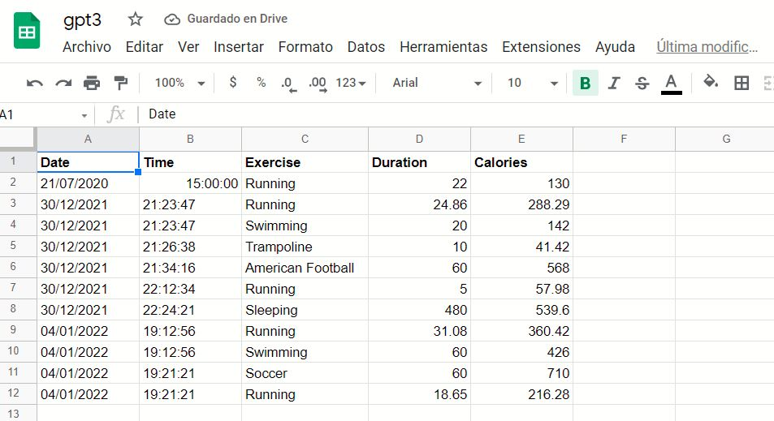

# Workout-Tracking-Using-Google-Sheets

Uso de la api nutritionix  que utiliza gpt3 y sheety que permite guardar datos en google sheets

Al ejecutar el programa en python el usuario debera ingresar las actividades que realizo en ingles y en pasado, haciendo uso de la api nutritionix se procesaran esos datos con gpt3

Se calcularan las calorias y el tiempo empleado en cada actividad

finalmente se guardaran esos datos en google sheets para ello se hara uso de la api sheety.

